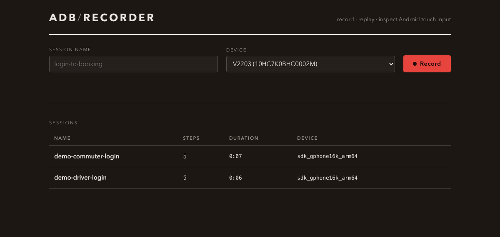
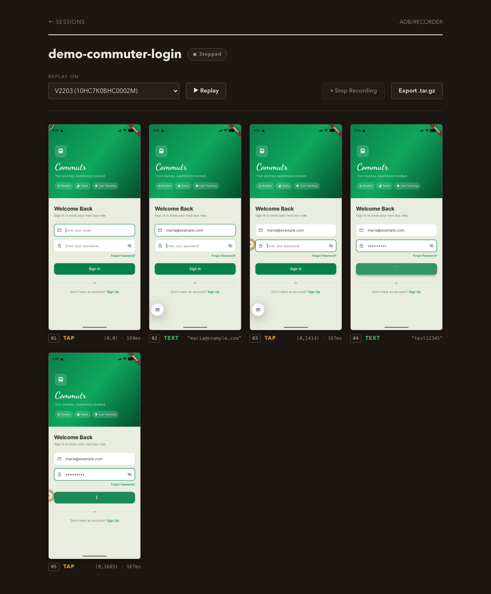

# adb-recorder

Record touch and keyboard input on an Android device/emulator via `adb`,
browse a screenshot per step, and replay a recorded session — a local tool for
capturing and repeating manual test flows (login → booking, onboarding, etc.)
without a full test-automation framework.

Keystrokes (hardware keys, or the host keyboard on an emulator) are captured
as text steps and replayed with `input text` / `input keyevent`.
**Anything typed while recording — including passwords — is stored in plain
text in the session's `events.log` and `steps.json` and shown in the UI.**
Don't record real credentials you can't afford to have on disk.

  

## Features

- **Record** every tap, swipe, and keystroke on a connected device or
  emulator, with a live screenshot captured for each step and streamed to the
  browser over a websocket as it happens.
- **Replay** a session verbatim, on the same device or a different one (with
  a confirmation prompt if resolution/serial don't match).
- **Gesture overlays** on each screenshot — a ring at the tap point, a traced
  path for swipes — so a recording is readable at a glance.
- **Export** a session as a self-contained `.tar.gz` (raw event log, step
  metadata, screenshots).
- Two-click confirmation before deleting a session, since sessions can
  contain recorded credentials and deletion is permanent.
- Light/dark UI that follows your OS theme.

  

## Requirements

- Node.js 20+
- `adb` on your `PATH`, with exactly one device/emulator connected (or pass a
  specific serial in the UI's device dropdown if multiple are attached)
- **Replay fidelity depends on root.** Raw replay uses `adb shell sendevent`,
  which writes directly to `/dev/input/eventN`; on a production ("user" build)
  device or emulator SELinux denies that write to the `shell` domain, so raw
  replay needs a rooted device or a `userdebug`/`eng` AVD (`adb root`
  succeeds — check with `adb shell getprop ro.build.type`). On unrooted
  devices replay **automatically falls back** to synthesizing the recorded
  gestures with `adb shell input tap`/`input swipe`/`input text`/`input
  keyevent` (scaled to the target screen), which works everywhere but loses
  pressure/multi-touch nuance.
  Recording only needs read access via `getevent`, which works on any build.

## Usage

    npm install
    npm start

Open http://localhost:4545, name a session, pick a device, click **Record**,
then interact with your device/emulator normally — each tap, swipe, and
keystroke is captured with a screenshot in real time. Click **Stop** when
done.

From the session page you can **Replay** the recorded session, or **Export**
it as a `.tar.gz`.

The port defaults to `4545`; override it with `PORT=<port> npm start`.

## Tests

    npm test

## How it works

See `docs/superpowers/specs/2026-07-16-adb-recorder-design.md` for the full
design. In short: `adb shell getevent -t` streams raw numeric input events
across all devices, which are split by originating node into touch gestures
(tap/swipe) and keystrokes (text/key), screenshotted, and saved to
`sessions/<name>/`. Replay pipes the same raw events back through `adb shell
sendevent` on rooted devices, or synthesizes the parsed steps with `adb shell
input` on unrooted ones — either way preserving original timing.

## License

MIT — see [LICENSE](LICENSE).
